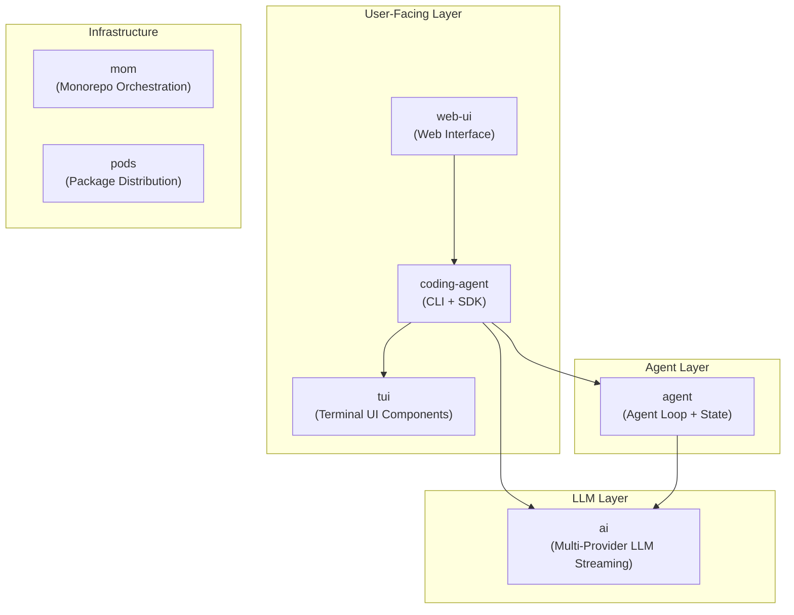

# High-Level Design (HLD)

## Package Architecture

Pi is a monorepo with layered packages, each building on the previous:



## Key Design Principles

1. **No sub-agents** - Single agent loop, extensions add capabilities
2. **No permission popups** - Containerize or build with extensions
3. **Extensibility-first** - Extensions, skills, prompt templates, themes
4. **Provider-agnostic** - Unified streaming API across 20+ LLM providers
5. **Session-as-tree** - JSONL files with branching, compaction, labels

## Component Responsibilities

| Package | Responsibility |
|---------|---------------|
| `ai` | LLM streaming, provider abstraction, model registry, token counting |
| `agent` | Stateful agent loop, tool execution, message queues, event system |
| `coding-agent` | Session management, tools (read/edit/bash/write), extensions, system prompt, CLI modes |
| `tui` | Terminal UI primitives (editor, lists, overlays) |
| `web-ui` | Browser-based interface |

## Data Flow Overview

```
User Input → CLI/TUI → AgentSession.prompt()
                            ↓
                    Extension Input Hook
                            ↓
                    Skill/Template Expansion
                            ↓
                    Agent.prompt() → AgentLoop
                            ↓
                    convertToLlm → streamSimple
                            ↓
                    LLM Provider (Anthropic/OpenAI/Google/...)
                            ↓
                    AssistantMessage (streamed)
                            ↓
                    Tool Calls → Tool Execution
                            ↓
                    Tool Results → Back to LLM
                            ↓
                    (loop until no tool calls)
                            ↓
                    Session Persistence (JSONL)
```
