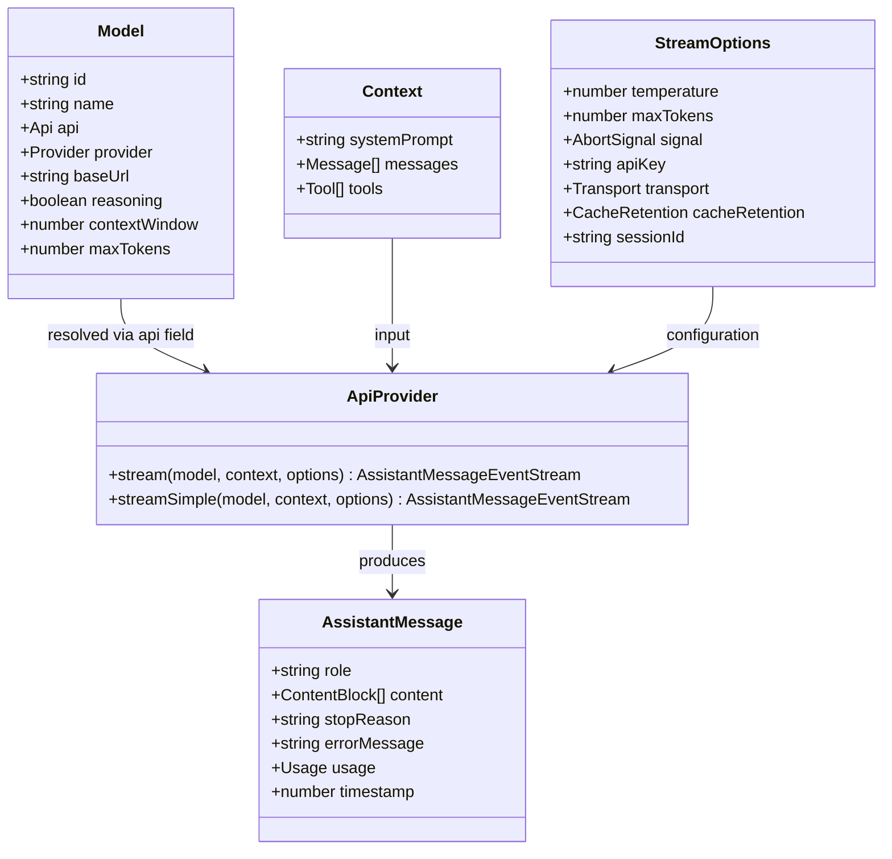
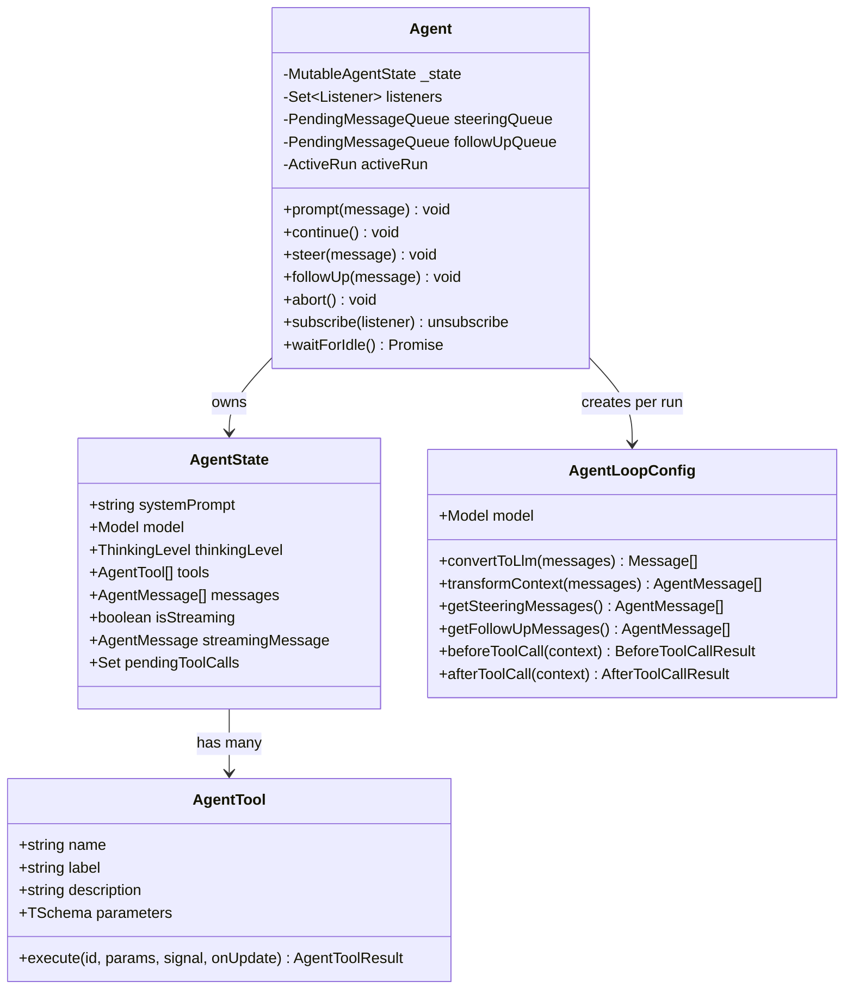
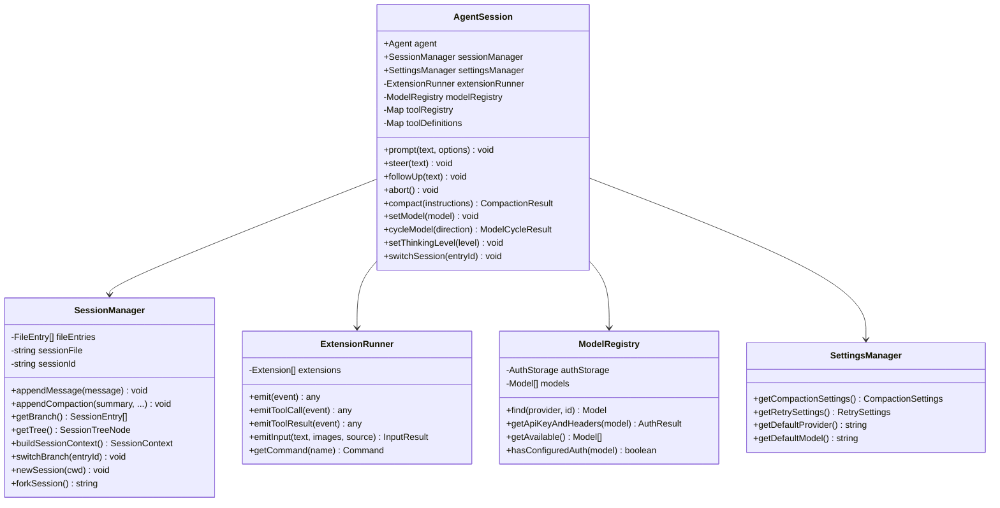

# Low-Level Design (LLD)

## Package: `ai` - LLM Abstraction Layer

## Package: `agent` - Agent Loop

## Package: `coding-agent` - Core Module

## Built-in Tools

| Tool | File | Purpose |
|------|------|---------|
| `read` | `tools/read.ts` | Read files with line ranges |
| `edit` | `tools/edit.ts` | Search-and-replace edits with diff output |
| `write` | `tools/write.ts` | Create/overwrite files |
| `bash` | `tools/bash.ts` | Shell command execution with timeout |
| `grep` | `tools/grep.ts` | Ripgrep-based search |
| `find` | `tools/find.ts` | File discovery with glob patterns |
| `ls` | `tools/ls.ts` | Directory listing |

## Session Entry Types

| Entry Type | Purpose |
|------------|---------|
| `session` | File header (version, id, cwd) |
| `message` | User/assistant/toolResult messages |
| `model_change` | Model switch record |
| `thinking_level_change` | Thinking level switch |
| `compaction` | Context compaction boundary |
| `branch_summary` | Summary of abandoned branch |
| `custom` | Extension-persisted data |
| `custom_message` | Extension messages in LLM context |
| `label` | User-defined bookmarks |
| `session_info` | Display name metadata |
