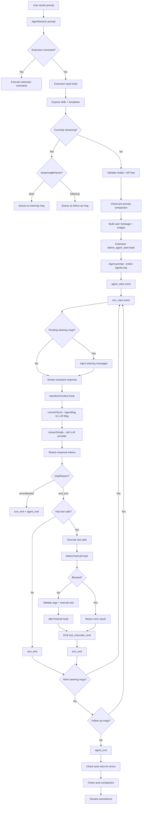
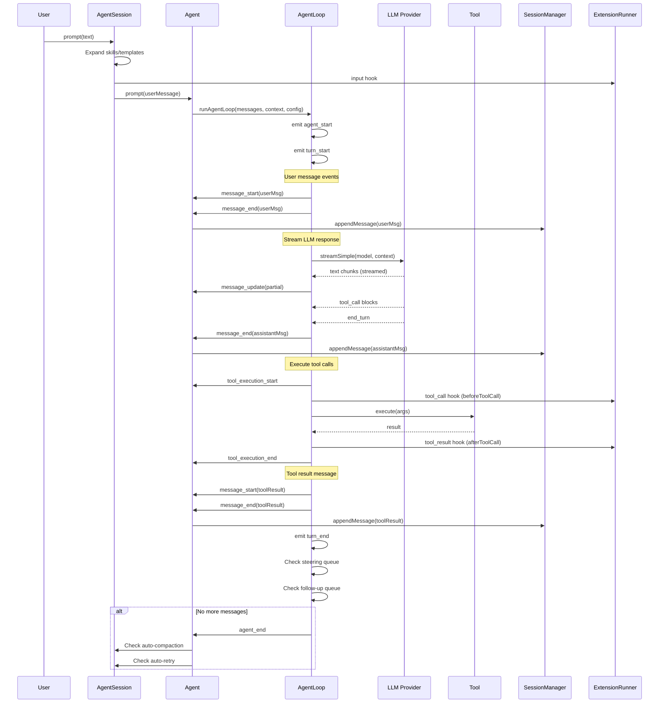
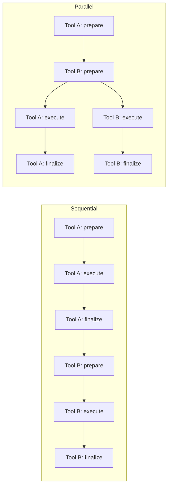
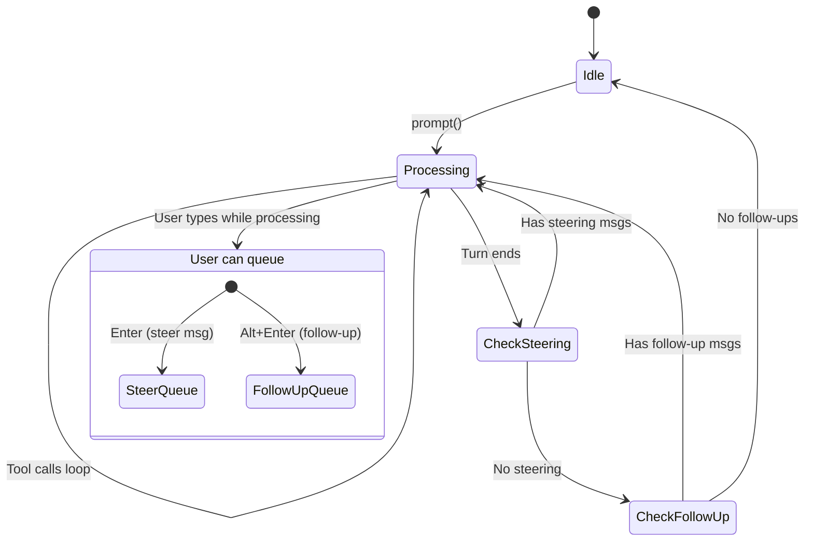

# Main Orchestration Flow

## 1. Agent Loop with Tool Calls

The core orchestration loop processes user prompts, streams LLM responses, executes tool calls, and loops until the model stops requesting tools.

## 2. Message Event Lifecycle

Every message passes through a consistent event lifecycle:

## 3. Tool Execution Modes

## 4. Message Queue System

