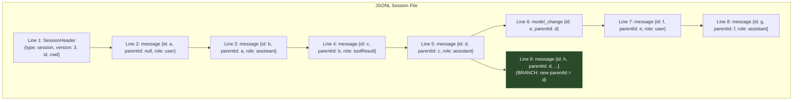
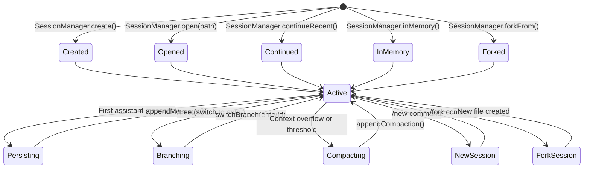
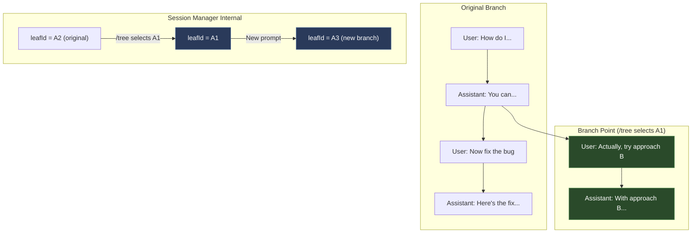
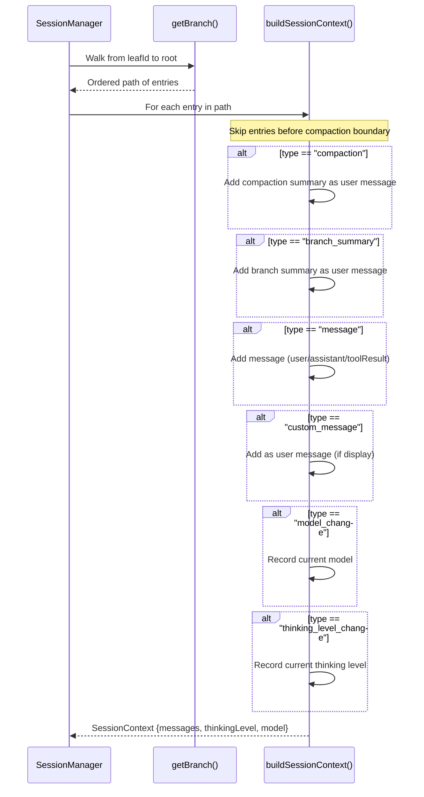
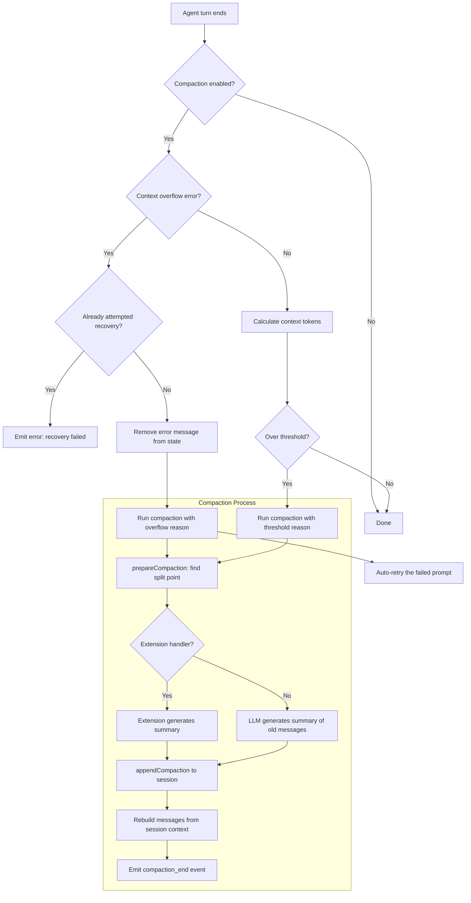

# Session Management

## Session File Structure

Sessions are stored as JSONL files with a tree structure. Each entry has an `id` and `parentId`, enabling in-place branching.



## Session Lifecycle



## Session Branching in Detail



## Session Context Building

`buildSessionContext()` reconstructs the LLM message array from the tree:



## Compaction Flow

When context exceeds the threshold or overflows:



## Session Storage Layout

```
~/.pi/agent/
  sessions/
    <encoded-cwd-1>/
      2025-01-15T10-30-00-000Z_<uuid>.jsonl
      2025-01-16T14-20-00-000Z_<uuid>.jsonl
    <encoded-cwd-2>/
      ...
  auth.json
  models.json
  settings.json
  keybindings.json
```
