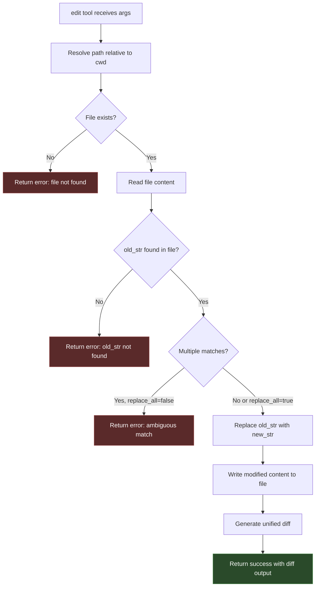
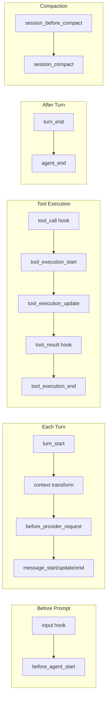

# Coding Agent: Code Implementation Example

## Example: User asks "Fix the typo in README.md"

This traces the full path from user input to file modification.

```mermaid
sequenceDiagram
    participant User
    participant TUI as InteractiveMode
    participant AS as AgentSession
    participant Ext as ExtensionRunner
    participant Ag as Agent
    participant Loop as AgentLoop
    participant LLM as LLM Provider
    participant ReadTool as read tool
    participant EditTool as edit tool
    participant SM as SessionManager

    User->>TUI: Types "Fix the typo in README.md"
    User->>TUI: Presses Enter
    TUI->>AS: prompt("Fix the typo in README.md")

    Note over AS: 1. Check for /commands - not a command
    Note over AS: 2. Extension input hook - no transform
    Note over AS: 3. Expand skills/templates - no match
    Note over AS: 4. Not currently streaming
    Note over AS: 5. Validate model + API key

    AS->>AS: Check pre-prompt compaction
    AS->>AS: Build user message
    AS->>Ext: before_agent_start hook
    Ext-->>AS: Optional system prompt modifications

    AS->>Ag: prompt([{role: user, content: "Fix the typo..."}])

    Note over Ag: === Agent Loop Starts ===
    Ag->>AgentLoop: runAgentLoop(messages, context, config)

    Loop->>AgentLoop: emit(agent_start)
    Loop->>AgentLoop: emit(turn_start)
    Loop->>Ag: emit(message_start, userMsg)
    Loop->>Ag: emit(message_end, userMsg)
    Ag->>SM: appendMessage(userMsg)

    Note over AgentLoop: === Turn 1: LLM decides to read file ===
    Loop->>LLM: streamSimple(model, context + tools)
    LLM-->>AgentLoop: "I'll read the README first"
    LLM-->>AgentLoop: toolCall: read({path: "README.md"})

    Loop->>Ag: emit(message_end, assistantMsg)
    Ag->>SM: appendMessage(assistantMsg)

    Loop->>Ag: emit(tool_execution_start, "read")
    Loop->>Ext: beforeToolCall hook
    Ext-->>AgentLoop: allow

    Loop->>ReadTool: execute("README.md")
    ReadTool-->>AgentLoop: {content: [{type: text, text: "file contents..."}]}

    Loop->>Ext: afterToolCall hook
    Loop->>Ag: emit(tool_execution_end, result)
    Loop->>Ag: emit(message_end, toolResultMsg)
    Ag->>SM: appendMessage(toolResultMsg)

    Loop->>AgentLoop: emit(turn_end)
    Loop->>AgentLoop: Check steering queue - empty

    Note over AgentLoop: === Turn 2: LLM applies the fix ===
    Loop->>AgentLoop: emit(turn_start)
    Loop->>LLM: streamSimple(context + read result)
    LLM-->>AgentLoop: "I found the typo on line 5"
    LLM-->>AgentLoop: toolCall: edit({path: "README.md", old: "teh", new: "the"})

    Loop->>Ag: emit(message_end, assistantMsg2)
    Ag->>SM: appendMessage(assistantMsg2)

    Loop->>Ag: emit(tool_execution_start, "edit")
    Loop->>EditTool: execute({path, old, new})
    EditTool->>EditTool: Read file, validate old_str exists
    EditTool->>EditTool: Apply replacement, write file
    EditTool-->>AgentLoop: {content: "Diff output", details: {diff, path}}

    Loop->>Ag: emit(tool_execution_end, result)
    Loop->>Ag: emit(message_end, toolResultMsg2)
    Ag->>SM: appendMessage(toolResultMsg2)

    Loop->>AgentLoop: emit(turn_end)
    Loop->>AgentLoop: Check steering queue - empty

    Note over AgentLoop: === Turn 3: LLM confirms completion ===
    Loop->>AgentLoop: emit(turn_start)
    Loop->>LLM: streamSimple(context + edit result)
    LLM-->>AgentLoop: "Fixed the typo on line 5: teh -> the"
    Note over LLM: stopReason: end_turn (no tool calls)

    Loop->>Ag: emit(message_end, finalMsg)
    Ag->>SM: appendMessage(finalMsg)

    Loop->>AgentLoop: emit(turn_end)
    Loop->>AgentLoop: No steering, no follow-ups
    Loop->>Ag: emit(agent_end)

    Note over Ag: === Post-Loop Processing ===
    Ag->>AS: Check auto-retry (no errors)
    AS->>AS: Check auto-compaction (token threshold)

    TUI->>User: Display "Fixed the typo on line 5 teh -> the"
```

## Tool Execution Detail: edit tool



## Extension Hooks During Execution

At each stage, extensions can intercept and modify behavior:


